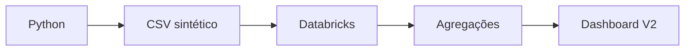
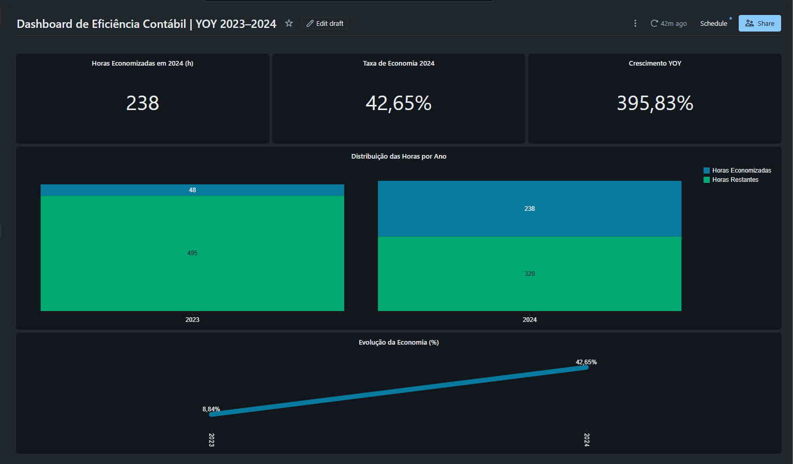

# V2 — Dashboard de Eficiência Contábil no Databricks

## Visão geral

A V2 evolui o projeto original ao levar a análise para o Databricks. O objetivo é apresentar, de forma direta, como o ganho de automação alterou o esforço necessário para atividades contábeis entre 2023 e 2024.

[Abrir dashboard publicado](https://dbc-cab2dac6-3287.cloud.databricks.com/dashboardsv3/01f19e65b1a11877a1941640dec970c5/published?o=7474652829983420)

## Perguntas respondidas

- Quantas horas foram economizadas em 2024?
- Qual foi a taxa de economia no período?
- Quanto as horas economizadas cresceram em relação a 2023?
- Como as horas totais se dividem entre esforço economizado e esforço restante?

## Arquitetura

O dataset sintético gerado no projeto original foi utilizado no Databricks, onde os indicadores anuais foram consolidados e disponibilizados para a camada de visualização.

## Estrutura do dataset

| Campo | Descrição |
| --- | --- |
| `ano` | Ano de referência da atividade |
| `atividade` | Atividade contábil simulada |
| `categoria` | Categoria da atividade |
| `horas_totais` | Esforço total estimado |
| `horas_economizadas` | Horas reduzidas por automação |
| `impacto_percentual` | Economia percentual do registro |
| `status` | Classificação manual ou automatizada |

## Regras dos indicadores

| Indicador | Regra | Resultado |
| --- | --- | ---: |
| Horas economizadas em 2024 | Soma das horas economizadas de 2024 | 238 h |
| Taxa de economia 2024 | Horas economizadas ÷ horas totais | 42,65% |
| Crescimento YOY | (Economia 2024 − Economia 2023) ÷ Economia 2023 | 395,83% |
| Horas restantes | Horas totais − horas economizadas | 320 h |

## Resultado anual

| Ano | Horas totais | Horas economizadas | Horas restantes | Taxa de economia |
| ---: | ---: | ---: | ---: | ---: |
| 2023 | 543 h | 48 h | 495 h | 8,84% |
| 2024 | 558 h | 238 h | 320 h | 42,65% |

## Visuais desenvolvidos

- **Horas Economizadas em 2024:** KPI com o ganho absoluto do ano.
- **Taxa de Economia 2024:** proporção do esforço total que foi economizada.
- **Crescimento YOY:** evolução das horas economizadas em relação ao ano anterior.
- **Horas Totais vs. Economizadas:** composição anual entre horas economizadas e restantes.
- **Evolução da Economia:** comparação da taxa de economia entre 2023 e 2024.

## Imagem do dashboard

## O que mudou em relação à V1

A V1 priorizou a construção do dataset, a conexão via Google Sheets e uma análise operacional no Looker Studio. A V2 reaproveita o mesmo problema de negócio para praticar o Databricks, consolidar métricas e criar uma leitura executiva mais enxuta.

Essa evolução demonstra que o projeto não foi apenas redesenhado: ele foi reconstruído em uma nova plataforma, com maior foco em processamento analítico, SQL, definição de indicadores e organização do fluxo do dado.

## Reprodutibilidade

O gerador de dados utilizado no projeto está disponível em [`src/gerar_dados.py`](../src/gerar_dados.py). Os dados são artificiais e destinados somente a estudo e demonstração técnica.

## Próximas evoluções

- Versionar o notebook e as consultas SQL exportadas do Databricks.
- Adicionar validações de qualidade dos dados.
- Organizar o fluxo em camadas de ingestão, transformação e consumo.
- Incluir novos períodos para ampliar a análise temporal.
